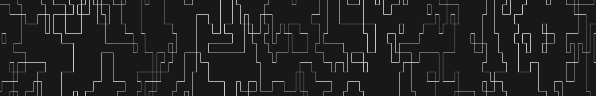
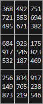

# Wave Function Collapse (WFC)

The Wave Function Collapse (WFC) is a C++ implementation designed to facilitate the procedural generation of topologies using the Wave Function Collapse algorithm. This library is particularly suited for applications in procedural content generation, such as game level design, architectural modeling, and texture generation, where the goal is to create complex, varied, and interesting patterns and structures from simple rules and inputs.

## Key Features

- **Header-Only Library**: The library is header-only, making it easy to integrate into existing projects without the need for additional build steps.
- **Generic Implementation**: Templated C++ classes allow for flexibility in the types of topologies generated, making it suitable for a wide range of applications.
- **State weighting**: The library supports state weighting, allowing users to bias the selection of states.
- **Customizable Constraints**: Users can define custom compatibility rules and weights for nodes, offering control over the generation process to achieve desired outcomes.
- **Error Handling**: Provides robust error handling to manage situations where the algorithm cannot find a valid solution under the given constraints.
- **Grid Topology Helpers**: Includes `GridTopology.h`, a set of helper functions designed to simplify the creation of grid-based topologies. It supports the creation of topologies based on tokens, adjacent states, and custom rules (functions), enhancing the library's utility for common procedural generation tasks.

## Getting Started

### Include the Library
To use the Wave Function Collapse library in your project, simply copy the `WFC` directory into your project's include directory. You can then include the necessary headers in your source files to access the library's functionality.

### Example Usage
There is an example usage of the library in the `example` directory. The example includes a simple 2D grid-based topology generation and a sudoku solver using the Wave Function Collapse algorithm.

#### Pipes

#### Sudoku

## Dependencies
The library has no external dependencies and is written in standard C++.
